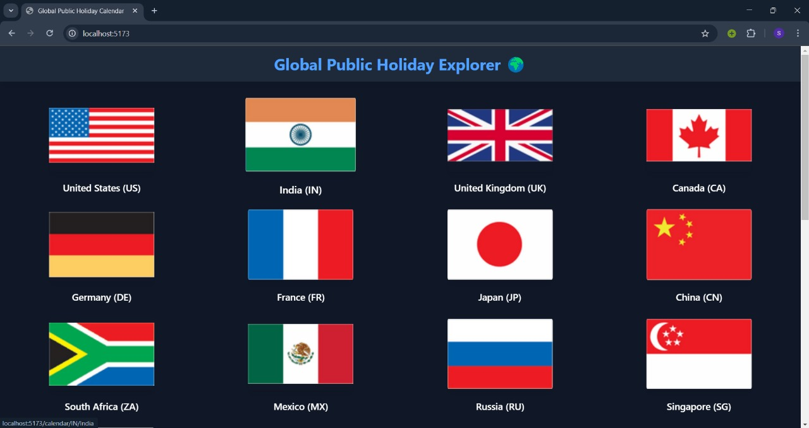
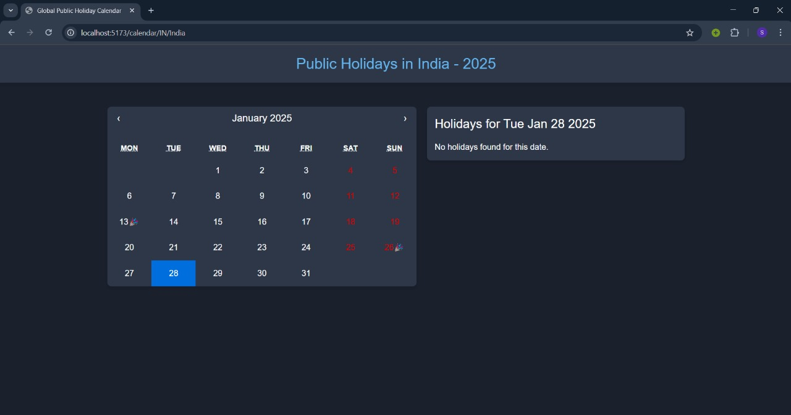
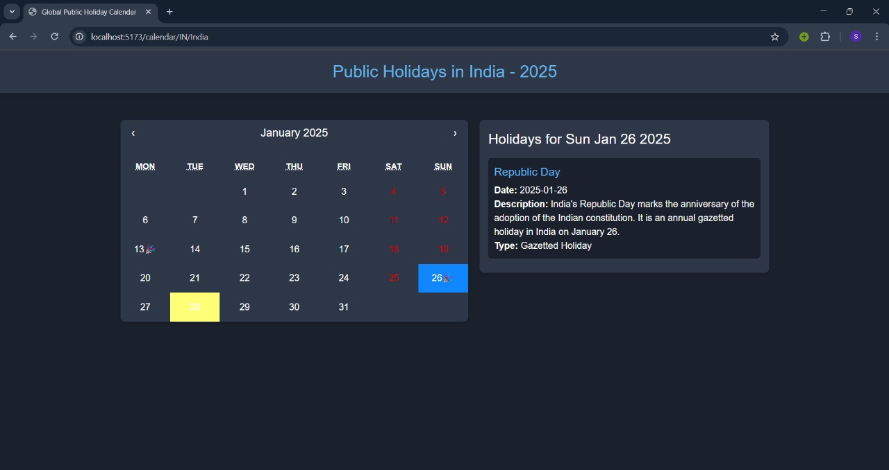

# Public Holiday Calendar

A web application to explore public holidays for different countries with an interactive calendar and holiday details.

## Features
- **Main Page**: Displays a list of countries with their flags.
- **Holiday Calendar**: View holidays for a selected country on an interactive calendar.
- **Holiday Details**: Select a specific date to view detailed information about holidays on that day.

## Technologies Used
- **Frontend**: React (with Vite bundler), Tailwind CSS, MUI, React Calendar
- **Backend**: Node.js, Express.js
- **Database**: PostgreSQL (via Sequelize ORM)

## How It Works
1. Select a country from the main page.
2. View the holiday calendar for the selected country.
3. Click on a date with a holiday to view its details.

## Project Screenshots

### 1. Main Page - Flags
Displays a list of countries with their flags. Users can select a country to view its holiday calendar.



### 2. Calendar - Country Selected
Shows the calendar for a selected country.



### 3. Calendar - Holiday Selected
Highlights a holiday on the calendar and shows detailed information.



## Installation

1. Clone the repository:
   ```bash
   git clone https://github.com/Surya-2004/Public-Holiday-Calendar.git
   ```
2. Navigate to the project directory:
   ```bash
   cd Public-Holiday-Calendar
   ```
3. Install dependencies for both backend and frontend:
   ```bash
   cd backend
   npm install
   cd ../frontend
   npm install
   ```
4. Add ```.env``` files:
   - **Backend:** Add your database configuration and API keys in ```backend/.env```.
   - **Frontend:** Add your API base URL in ```frontend/.env```.
5. Run the development servers:
   - **Backend:**
      ```bash
      cd backend
      npm start
      ```
   - **Frontend:**
      ```bash
      cd frontend
      npm run dev
      ```
